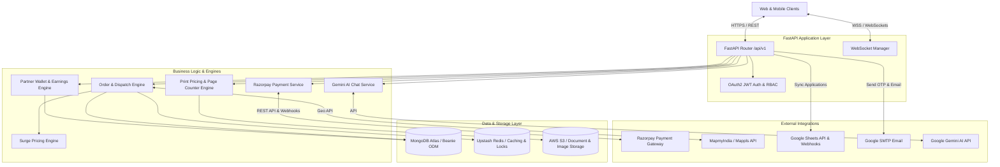

# Helper FullStack Backend - System Architecture

This document provides a comprehensive overview of the architecture, design patterns, data flows, and technical infrastructure of the **Helper FullStack Backend**.

---

## 1. System Overview

**Helper FullStack Backend** is a high-performance, asynchronous REST & WebSocket API built with **FastAPI**, **Beanie ODM**, **MongoDB Atlas**, **Upstash Redis**, **AWS S3**, and **Razorpay Payment Gateway**. 

It powers a multi-service hyper-local platform supporting:
1. **Quick Commerce**: Fast delivery of snacks, drinks, cakes, and stationery items.
2. **Print & Xerox Service**: Automated PDF page counter, document upload, custom printing & binding options.
3. **Porter Courier (< 5 kg)**: Hyper-local parcel pickup and delivery service.
4. **Handwritten Assignment Writer Service**: On-demand student assignment writing service.
5. **Delivery Partner Ecosystem**: GPS-based order dispatching (1 km ringing algorithm), real-time location tracking, partner wallet earnings, and 48-hour holding period payout system.
6. **Payment Gateway**: Razorpay payment integration with HMAC-SHA256 signature verification and webhook event processing.
7. **AI Support Assistant**: Integrated Google Gemini AI (`gemini-1.5-flash`) support bot.

---

## 2. High-Level Architecture Diagram



---

## 3. Technology Stack

| Layer | Technology | Purpose |
| :--- | :--- | :--- |
| **Framework** | Python 3.13 / FastAPI | Asynchronous Web Framework |
| **ASGI Server** | Uvicorn | High-performance ASGI Web Server |
| **Database** | MongoDB Atlas | Primary NoSQL Document Database |
| **ODM Layer** | Beanie ODM / Motor | Async Object Document Mapper based on Pydantic v2 |
| **Cache & Locks** | Upstash Redis | Session caching, rate limiting, and temporary state |
| **File Storage** | AWS S3 / Boto3 | Cloud storage for Xerox documents, assignment files, & partner KYC |
| **Payments** | Razorpay SDK | Razorpay Orders, HMAC SHA256 verification, and Webhooks |
| **Geolocation** | Haversine + Mappls API | Distance calculation & geocoding |
| **AI Integration** | Google Gemini AI (`gemini-1.5-flash`) | AI customer assistant & automated issue summarization |
| **Email Service** | Google SMTP | Authentication OTPs & system email notifications |
| **Google Sync** | Google Sheets API & gspread | Direct partner application export to Google Sheets |
| **Testing** | Pytest, pytest-asyncio, Mongomock Motor | Automated async API & unit testing |

---

## 4. Key Subsystems & Features

### 4.1 Order Management & Ringing Dispatch Algorithm
- **Order Types**: Quick Commerce, Print Service, Porter Courier (< 5 kg), Assignment Writer.
- **Ringing Algorithm**: When an order is placed, active delivery partners within a **1 km radius** of the pickup/store location are notified via WebSockets/polling (`notified_partner_ids`).
- **Partner Acceptance**: Atomic order assignment (`accept_order_partner`) prevents race conditions between multiple delivery partners.
- **Physical Document Pickup**: Specialized flow for Xerox orders where delivery partners physically collect hardcopy notes from customers.

### 4.2 Razorpay Payment Gateway Integration
- **Order Creation (`/payments/razorpay/create-order`)**: Generates a Razorpay Order (`order_...`) matching the system order total (`amount_in_paise`).
- **Signature Verification (`/payments/razorpay/verify`)**: Validates `razorpay_signature` using HMAC SHA256 (`f"{razorpay_order_id}|{razorpay_payment_id}"`, `RAZORPAY_KEY_SECRET`).
- **Webhooks (`/payments/razorpay/webhook`)**: Handles asynchronous `payment.captured` & `order.paid` notifications for idempotent database updates.

### 4.3 Xerox Print Pricing & Page Counter Engine
- **Automated Page Inspection**: Reads uploaded PDF files using `pypdf` to accurately calculate total page counts (`num_pages`).
- **Pricing Calculation**: Factors in color mode (`black_and_white` vs `color`), paper size (`A4`, `A3`), single/double-sided printing, and binding (`spiral`, `channel_file`).

### 4.4 Delivery Partner Wallet & Earnings Engine
- **Earnings Allocation**: Upon order delivery completion, delivery fees are credited to the partner's wallet balance.
- **48-Hour Holding Period**: Prevents immediate fraudulent withdrawal by enforcing a 48-hour maturity rule for withdrawable balance.
- **Manual Admin Payouts**: Partners submit withdrawal requests (UPI ID / Bank details), which are reviewed and manually approved by admins.

---

## 5. Security & Authentication Model

### 5.1 Role-Based Access Control (RBAC)
User access is strictly enforced via JWT Bearer Tokens containing encoded user IDs and roles:
- `USER` (Customer): Can place orders, view order history, track live order location, and initiate payments.
- `PARTNER` (Delivery Partner): Requires device GPS turned ON to view available orders, accept orders, update delivery status, and request wallet withdrawals.
- `ADMIN` (Superuser): Access to real-time operations dashboard, partner onboarding approval, product catalog management, and withdrawal processing.

### 5.2 Security Best Practices
- **Password Hashing**: Passwords stored using `bcrypt`.
- **HMAC Verification**: All payment completions strictly verified via HMAC SHA256 cryptographic signatures.
- **Input Validation**: Pydantic v2 schemas strictly validate all incoming API payloads.
- **Rate Limiting**: Configured rate limits on public & authentication endpoints to prevent brute-force attacks.

---

## 6. Directory Structure

```
Helper-FullStack-Backend/
├── app/
│   ├── api/
│   │   ├── deps.py                 # Common FastAPI dependencies (Auth, GPS, Admin)
│   │   └── v1/
│   │       ├── router.py           # Main API v1 Router aggregator
│   │       └── endpoints/          # API Route Controllers
│   │           ├── admin.py
│   │           ├── admin_dashboard.py
│   │           ├── ai_chat.py
│   │           ├── assignment_service.py
│   │           ├── auth.py
│   │           ├── cart.py
│   │           ├── health.py
│   │           ├── orders.py
│   │           ├── partner.py
│   │           ├── payments.py     # Razorpay Payment Gateway routes
│   │           ├── print_service.py
│   │           ├── products.py
│   │           ├── support.py
│   │           ├── users.py
│   │           ├── wallet.py
│   │           └── ws.py           # WebSocket endpoint
│   ├── core/
│   │   ├── config.py               # Pydantic BaseSettings environment loader
│   │   ├── database.py             # Beanie ODM & MongoDB Motor Client setup
│   │   ├── exceptions.py           # Exception handlers & custom AppException classes
│   │   ├── middleware.py           # CORS, Logging, and Rate Limiting Middleware
│   │   └── security.py             # JWT generation, verification, and bcrypt hashing
│   ├── crud/                       # Database CRUD operations layer
│   │   ├── crud_cart.py
│   │   ├── crud_order.py
│   │   ├── crud_product.py
│   │   ├── crud_support.py
│   │   └── crud_user.py
│   ├── models/                     # Beanie ODM MongoDB Document Models
│   │   ├── base.py
│   │   ├── cart.py
│   │   ├── order.py
│   │   ├── otp.py
│   │   ├── product.py
│   │   ├── support_ticket.py
│   │   ├── user.py
│   │   ├── wallet.py
│   │   └── withdrawal.py
│   ├── schemas/                    # Pydantic DTO validation schemas
│   │   ├── ai_chat.py
│   │   ├── assignment_service.py
│   │   ├── location.py
│   │   ├── order.py
│   │   ├── partner.py
│   │   ├── payment.py              # Razorpay schemas
│   │   ├── print_service.py
│   │   ├── product.py
│   │   ├── response.py             # Standardized APIResponse wrapper
│   │   ├── user.py
│   │   └── wallet.py
│   ├── services/                   # Application Domain Services & External Engines
│   │   ├── ai_chat_service.py
│   │   ├── analytics_service.py
│   │   ├── dispatch_engine.py
│   │   ├── geo_service.py
│   │   ├── google_sheets_service.py
│   │   ├── page_counter_service.py
│   │   ├── print_pricing_engine.py
│   │   ├── razorpay_service.py     # Razorpay Gateway Service
│   │   ├── redis_service.py
│   │   ├── s3_service.py
│   │   ├── surge_pricing_engine.py
│   │   ├── wallet_service.py
│   │   └── websocket_manager.py
│   └── main.py                     # FastAPI application factory & lifecycle initialization
├── tests/                          # Automated Pytest suite
│   ├── conftest.py                 # Async test client & database fixtures
│   └── api/                        # Integration API tests
│       ├── test_admin.py
│       ├── test_orders.py
│       ├── test_partner.py
│       ├── test_payments.py       # Razorpay integration test suite
│       └── test_wallet_and_withdrawals.py
├── .env.example                    # Environment variable template
├── Dockerfile                      # Production Docker container setup
├── docker-compose.yml              # Local container orchestration
├── pyproject.toml                  # Python package configuration
└── requirements.txt                # Python dependencies
```

---

## 7. Execution & Development Setup

### 7.1 Local Environment
```bash
# 1. Activate virtual environment
.venv\Scripts\activate      # Windows
source .venv/bin/activate    # Linux/macOS

# 2. Install dependencies
pip install -r requirements.txt

# 3. Start development server
uvicorn app.main:app --reload --host 0.0.0.0 --port 8000
```

### 7.2 Running Tests
```bash
# Run all unit and integration tests
pytest

# Run Razorpay payment gateway tests
pytest tests/api/test_payments.py
```
