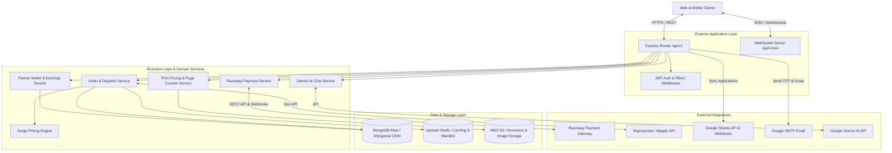

# Helper FullStack Backend - System Architecture

This document provides a comprehensive overview of the architecture, design patterns, data flows, and technical infrastructure of the **Helper FullStack Backend**.

---

## 1. System Overview

**Helper FullStack Backend** is a high-performance, asynchronous REST & WebSocket API built with **Node.js (v24)**, **Express.js**, **TypeScript**, **Mongoose ODM**, **MongoDB Atlas**, **Upstash Redis**, **AWS S3**, and **Razorpay Payment Gateway**. 

It powers a multi-service hyper-local platform supporting:
1. **Quick Commerce**: Fast delivery of snacks, drinks, cakes, and stationery items.
2. **Print & Xerox Service**: Automated PDF page counter, document upload, custom printing & binding options.
3. **Porter Courier (< 5 kg)**: Hyper-local parcel pickup and delivery service.
4. **Handwritten Assignment Writer Service**: On-demand student assignment writing service.
5. **Delivery Partner Ecosystem**: GPS-based order dispatching (1 km ringing algorithm), real-time location tracking, partner wallet earnings, and 48-hour holding period payout system.
6. **Payment Gateway**: Razorpay payment integration with HMAC-SHA256 signature verification and webhook event processing.
7. **AI Support Assistant**: Integrated Google Gemini AI (`gemini-1.5-flash`) support bot.

---

## 2. High-Level Architecture Diagram



---

## 3. Technology Stack

| Layer | Technology | Purpose |
| :--- | :--- | :--- |
| **Runtime & Framework** | Node.js (v24) / Express.js / TypeScript | Asynchronous REST Web Framework & strict typing |
| **Database** | MongoDB Atlas / Mongoose ODM | Primary NoSQL Document Database & Typed Schemas |
| **Cache & In-Memory** | Upstash Redis (ioredis) | Blacklist tokens, session caching & rate limiting |
| **File Storage** | AWS S3 SDK v3 | Cloud storage for Xerox documents, assignment files, & partner KYC |
| **Payments** | Razorpay Node SDK | Orders, HMAC SHA256 verification, and Webhooks |
| **Geolocation** | Haversine + Mappls API | 1 km radius distance calculation & geocoding |
| **AI Integration** | Google Gemini AI (`@google/generative-ai`) | AI customer assistant & automated support bot |
| **Email Service** | Nodemailer (Google SMTP) | Authentication OTPs & system email notifications |
| **Google Sync** | Google Sheets API & Webhooks | Direct partner application export to Google Sheets |
| **PDF Processing** | pdf-parse | Automated document page count inspection |
| **Realtime** | ws (WebSockets) | Live partner GPS tracking & 1km ringing dispatch |
| **Testing** | Jest, ts-jest, Supertest, MongoMemoryServer | Automated isolated integration & unit testing |

---

## 4. Key Subsystems & Features

### 4.1 Order Management & Ringing Dispatch Algorithm
- **Order Types**: Quick Commerce, Print Service, Porter Courier (< 5 kg), Assignment Writer.
- **Ringing Algorithm**: When an order is placed, active delivery partners within a **1 km radius** of the pickup/store location are notified via WebSockets/polling (`notified_partner_ids`).
- **Partner Acceptance**: Atomic order assignment (`acceptOrder`) prevents race conditions between multiple delivery partners.
- **Physical Document Pickup**: Specialized flow for Xerox orders where delivery partners physically collect hardcopy notes from customers.

### 4.2 Razorpay Payment Gateway Integration
- **Order Creation (`/payments/razorpay/create-order`)**: Generates a Razorpay Order (`order_...`) matching the system order total (`amount_in_paise`).
- **Signature Verification (`/payments/razorpay/verify`)**: Validates `razorpay_signature` using HMAC SHA256 (`${razorpay_order_id}|${razorpay_payment_id}`, `RAZORPAY_KEY_SECRET`).
- **Webhooks (`/payments/razorpay/webhook`)**: Handles asynchronous `payment.captured` & `order.paid` notifications for idempotent database updates.

### 4.3 Xerox Print Pricing & Page Counter Engine
- **Automated Page Inspection**: Reads uploaded PDF files using `pdf-parse` to accurately calculate total page counts (`num_pages`).
- **Pricing Calculation**: Factors in color mode (`black_and_white` vs `color`), paper size (`A4`, `A3`), single/double-sided printing, and binding (`spiral`, `channel_file`).

### 4.4 Delivery Partner Wallet & Earnings Engine
- **Earnings Allocation**: Upon order delivery completion, delivery fees are credited to the partner's wallet balance.
- **48-Hour Holding Period**: Prevents immediate fraudulent withdrawal by enforcing a 48-hour maturity rule for withdrawable balance.
- **Manual Admin Payouts**: Partners submit withdrawal requests (UPI ID / Bank details), which are reviewed and manually approved by admins.

---

## 5. Security & Authentication Model

### 5.1 Role-Based Access Control (RBAC)
User access is strictly enforced via JWT Bearer Tokens containing encoded user IDs and roles:
- `USER` (Customer): Can place orders, view order history, track live order location, and initiate payments.
- `PARTNER` (Delivery Partner): Requires device GPS turned ON to view available orders, accept orders, update delivery status, and request wallet withdrawals.
- `ADMIN` (Superuser): Access to real-time operations dashboard, partner onboarding approval, product catalog management, and withdrawal processing.

### 5.2 Security Best Practices
- **Password Hashing**: Passwords stored using `bcryptjs`.
- **HMAC Verification**: All payment completions strictly verified via HMAC SHA256 cryptographic signatures.
- **Input Validation**: Zod schemas strictly validate all incoming API payloads.
- **Rate Limiting**: Configured rate limits on public & authentication endpoints to prevent brute-force attacks.

---

## 6. Directory Structure

```
Helper-FullStack-Backend/
├── src/
│   ├── config/                     # Environment, Database, Logger config
│   │   ├── database.ts
│   │   ├── env.ts
│   │   └── logger.ts
│   ├── middlewares/                # Auth, RBAC, Error Handling, Validation, Uploads, Rate Limiter
│   │   ├── auth.ts
│   │   ├── errorHandler.ts
│   │   ├── rateLimiter.ts
│   │   ├── upload.ts
│   │   └── validate.ts
│   ├── models/                     # Mongoose Schemas & TypeScript Models
│   │   ├── Cart.ts
│   │   ├── Feedback.ts
│   │   ├── Order.ts
│   │   ├── OTP.ts
│   │   ├── PartnerWallet.ts
│   │   ├── Product.ts
│   │   ├── Rating.ts
│   │   ├── SupportTicket.ts
│   │   ├── User.ts
│   │   ├── WithdrawalRequest.ts
│   │   └── index.ts
│   ├── routes/                     # Express Router endpoints (/api/v1)
│   │   ├── admin.route.ts
│   │   ├── adminDashboard.route.ts
│   │   ├── aiChat.route.ts
│   │   ├── assignmentService.route.ts
│   │   ├── auth.route.ts
│   │   ├── cart.route.ts
│   │   ├── feedback.route.ts
│   │   ├── health.route.ts
│   │   ├── index.ts
│   │   ├── orders.route.ts
│   │   ├── partner.route.ts
│   │   ├── payments.route.ts
│   │   ├── printService.route.ts
│   │   ├── products.route.ts
│   │   ├── ratings.route.ts
│   │   ├── support.route.ts
│   │   ├── users.route.ts
│   │   └── wallet.route.ts
│   ├── schemas/                    # Zod DTO validation schemas
│   │   ├── assignment.schema.ts
│   │   ├── auth.schema.ts
│   │   ├── cart.schema.ts
│   │   ├── feedback.schema.ts
│   │   ├── location.schema.ts
│   │   ├── order.schema.ts
│   │   ├── partner.schema.ts
│   │   ├── payment.schema.ts
│   │   ├── print.schema.ts
│   │   ├── product.schema.ts
│   │   ├── rating.schema.ts
│   │   ├── support.schema.ts
│   │   ├── user.schema.ts
│   │   └── wallet.schema.ts
│   ├── services/                   # Business Logic & Domain Engines
│   │   ├── aiChat.service.ts
│   │   ├── analytics.service.ts
│   │   ├── auth.service.ts
│   │   ├── dispatch.service.ts
│   │   ├── email.service.ts
│   │   ├── geo.service.ts
│   │   ├── googleSheets.service.ts
│   │   ├── keepAlive.service.ts
│   │   ├── otp.service.ts
│   │   ├── pageCounter.service.ts
│   │   ├── printPricing.service.ts
│   │   ├── razorpay.service.ts
│   │   ├── redis.service.ts
│   │   ├── s3.service.ts
│   │   ├── surgePricing.service.ts
│   │   ├── wallet.service.ts
│   │   └── websocket.service.ts
│   ├── utils/                      # Security & helper functions
│   │   └── security.ts
│   ├── app.ts                      # Express application factory & middleware setup
│   └── server.ts                   # HTTP server & WebSocket bootstrap
├── tests/                          # Automated Jest & Supertest suite
│   ├── setup.ts                    # MongoMemoryServer lifecycle fixture
│   ├── auth.test.ts
│   ├── orders.test.ts
│   ├── partner.test.ts
│   ├── payments.test.ts
│   └── wallet.test.ts
├── .env.example                    # Environment variable template
├── Dockerfile                      # Production Docker container setup
├── docker-compose.yml              # Local container orchestration
├── package.json                    # Node.js dependencies and scripts
├── tsconfig.json                   # TypeScript configuration
└── render.yaml                     # Render cloud deployment blueprint
```

---

## 7. Execution & Development Setup

### 7.1 Local Environment
```bash
# 1. Install dependencies
npm install

# 2. Start development server with live reload
npm run dev

# 3. Build for production
npm run build

# 4. Start production server
npm start
```

### 7.2 Running Tests
```bash
# Run all unit and integration tests
npm test
```
